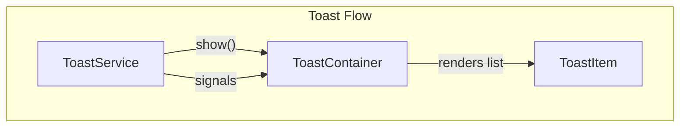

# Custom Toast Component - Best Practices and Implementation Plan

## Current State

- **No toast/snackbar** exists in the project. Errors are shown inline; modal is used for confirmations.
- **Stack**: Angular 21, Tailwind CSS, `@angular/cdk`, `lucide-angular`, signals.
- **Reference pattern**: [ModalService](src/app/core/services/modal.service.ts) + [Modal component](src/app/shared/components/modal/modal.ts) use service-driven state, signals, and enter/exit animations.

---

## Architecture Overview



- **ToastService**: Imperative API, holds toast queue as a signal.
- **ToastContainer**: Host component attached to `AppComponent`, listens to service.
- **ToastItem**: Single toast UI (message, type, icon, close button).

---

## Core Best Practices

### 1. Service-Driven Imperative API

| Principle         | Implementation                                                                            |
| ----------------- | ----------------------------------------------------------------------------------------- |
| Use a service     | `ToastService` with `show(message, options?)` — callable from any injectable or component |
| Signals for state | `toasts = signal<Toast[]>([])` — container reacts to changes                              |
| Minimal surface   | Methods: `show()`, `dismiss()`, `dismissAll()`                                            |

### 2. Render Outside App Tree (Portal/Overlay)

| Principle                     | Implementation                                                                   |
| ----------------------------- | -------------------------------------------------------------------------------- |
| Avoid overflow/z-index issues | Render toasts in a container appended to `body` (or use `@angular/cdk/overlay`)  |
| CDK Overlay (optional)        | Use `Overlay` + `OverlayRef` for positioning; project already has `@angular/cdk` |
| Simpler alternative           | Single `<app-toast-container>` in root layout, fixed to viewport                 |

**Recommendation**: Start with a fixed `ToastContainer` in `app.component.html` — simpler and matches current modal approach.

### 3. Toast Types and API

```typescript
type ToastType = "success" | "error" | "info" | "warning";

interface ToastOptions {
  type?: ToastType;
  duration?: number; // ms, 0 = manual dismiss only
  dismissible?: boolean;
}
```

- Default `duration`: 4000–5000ms.
- `duration: 0` = persistent until manually dismissed.

### 4. Multiple Toasts (Queue/Stack)

- Store toasts in an array/signal.
- Show latest on top (or bottom).
- Limit visible count (e.g. 3–5) and queue or drop older ones.
- Each toast has a unique `id` for `dismiss(id)`.

### 5. Accessibility

| Rule                     | Implementation                                                                 |
| ------------------------ | ------------------------------------------------------------------------------ |
| Non-blocking             | Do **not** trap focus (unlike modals); user keeps interacting with page        |
| Live region              | `role="status"` for success/info, `role="alert"` for error/warning             |
| `aria-live="polite"`     | Success/info; `aria-live="assertive"` for errors                               |
| `aria-atomic="true"`     | Announce full message                                                          |
| `prefers-reduced-motion` | Use `@media (prefers-reduced-motion: reduce)` to disable or shorten animations |
| Dismissible              | Close button with `aria-label="Chiudi notifica"`                               |

### 6. Animations

- **Duration**: ~150–300ms (consistent with existing modal and UI guidelines).
- **Use `transform` / `opacity`** rather than layout-changing properties for performance.
- Enter: slide-in + fade-in.
- Exit: fade-out (and optional slight slide).
- Use `transitionend` to remove from DOM when hidden (as in [modal.ts](src/app/shared/components/modal/modal.ts)).

### 7. Z-Index and Position

- Position: top-right or bottom-right.
- z-index above main content (e.g. 3000) but below modal overlay if needed.
- Spacing from viewport edges (e.g. `top-4 right-4` or `bottom-4 right-4`).

### 8. Styling (Tailwind)

- Match existing design: borders, rounded corners, subtle shadow.
- Type-specific colors: green (success), red (error), blue (info), amber (warning).
- Use `class-variance-authority` + `clsx` for variants (already in package.json).

---

## Proposed File Structure

```
src/app/
├── core/
│   └── services/
│       └── toast.service.ts          # ToastService
└── shared/
    └── components/
        └── toast/
            ├── toast-container.ts     # Host, renders list
            ├── toast-container.html
            ├── toast-container.css
            ├── toast-item.ts          # Single toast
            ├── toast-item.html
            └── toast-item.css
```

---

## Implementation Approach

### Phase 1: ToastService

- `toasts = signal<Toast[]>([])`.
- `show(message: string, options?: ToastOptions): string` — add toast, return id.
- `dismiss(id: string)` and `dismissAll()`.
- `Toast` model: `{ id, message, type, createdAt, duration, dismissible }`.

### Phase 2: ToastContainer

- Rendered in `app.component.html`.
- Reads `toastService.toasts()` and renders `<app-toast-item>` for each.
- Fixed positioning (`fixed top-4 right-4 z-3000` or bottom-right).

### Phase 3: ToastItem

- Inputs: `toast` (Toast model).
- Output: `dismiss` (emits id).
- Icon per type (using `lucide-angular`: CheckCircle, XCircle, Info, AlertTriangle).
- Auto-dismiss via `setTimeout` when `duration > 0`.
- Enter/exit animation with `isVisible` signal and `transitionend`, mirroring modal.
- Accessibility attributes: `role`, `aria-live`, `aria-atomic`.

### Phase 4: Integration

- Add `<app-toast-container />` to root layout.
- Provide `ToastService` in root (`providedIn: 'root'`).
- Replace or complement inline errors with `toastService.show('...', { type: 'error' })` where appropriate (e.g. in [post.service.ts](src/app/core/services/post.service.ts), auth, search).

---

## Dependencies

- No new packages required.
- Use existing: `@angular/cdk` (optional overlay), `lucide-angular`, Tailwind, `class-variance-authority`.

---

## Example Usage

```typescript
// In any component or service
constructor(private toast: ToastService) {}

onSuccess() {
  this.toast.show('Post pubblicato con successo', { type: 'success' });
}

onError() {
  this.toast.show('Qualcosa è andato storto. Riprova.', { type: 'error', duration: 6000 });
}
```

---

## Summary Checklist

- Service with imperative `show()` API
- Signal-based state for reactive rendering
- Multiple toasts with queue and unique ids
- Accessible: `role`, `aria-live`, no focus trap, `prefers-reduced-motion`
- Smooth 150–300ms enter/exit animations
- Fixed positioning and clear z-index
- Type-specific styling (success, error, info, warning)
- Optional CDK Overlay if future requirements need dynamic positioning
