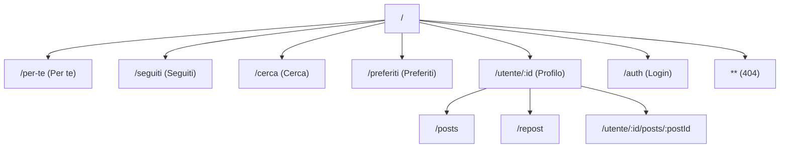

# ngFeed

Applicazione moderna di feed social realizzata con Angular 21. ngFeed permette di creare post, seguire altri utenti, cercare utenti, salvare preferiti e interagire con un feed personalizzato.

## Funzionalità

| Funzionalità | Posizione | Descrizione |
|--------------|-----------|-------------|
| **Autenticazione** | `features/auth/` | Firebase Auth, login/registrazione, toggle visibilità password, auto-login da localStorage, gestione scadenza token |
| **Post** | `features/posts/` | Creazione, modifica, eliminazione, like, salvataggio, commenti, vista post completo, menu opzioni |
| **Profili utente** | `features/user/` | Visualizzazione profilo, modifica profilo, tab post/repost, segui/smetti di seguire, card utente |
| **Feed home** | `features/home/` | Feed Per te (tutti i post), Feed Seguiti (lazy loaded), navigazione a tab |
| **Ricerca** | `features/search/` | Ricerca utenti con input debounced, filtro verificati, ordinamento per più seguiti |
| **Preferiti** | `features/favorites/` | Visualizzazione post salvati |
| **Tema** | `core/services/theme.service.ts` | Modalità chiaro/scuro/sistema, persistenza in localStorage, script anti-flash in `index.html` |
| **Modal e Toast** | `core/services/` | Modal centralizzato (crea/modifica/elimina/modifica-utente), notifiche toast |

## Architettura e pattern

- **Componenti standalone** – Nessun NgModule; tutti i componenti usano `imports` e API standalone
- **Stato basato su signal** – `signal()`, `computed()`, `effect()` nei servizi (PostService, UserService, AuthService, ModalService, ToastService, ThemeService)
- **Change detection OnPush** – Utilizzata ovunque per le performance
- **Lazy loading** – Le route Search, Favorites, Followed, Auth, User, FullPost, NotFound sono caricate in modo lazy
- **Dependency injection** – Funzione `inject()`, `providedIn: 'root'` per i servizi
- **Cleanup** – `DestroyRef` con `takeUntilDestroyed()` per la pulizia delle sottoscrizioni
- **Path alias** – `@/*` mappa a `src/app/*`
- **Struttura cartelle** – `core/` (layout, services, types, pages), `features/`, `shared/`

## Accessibilità

- **ARIA** – `aria-label`, `aria-live`, `aria-modal`, `aria-invalid`, `aria-describedby`, `role="dialog"`, `role="tablist"`, `role="alert"` su modal, toast, form e tab
- **Gestione focus** – Angular CDK A11y (`cdkTrapFocus`, `cdkFocusInitial`), direttiva custom `focus-field`, `focusFirstInvalidField()` in edit-user
- **Navigazione da tastiera** – `tabindex` dinamico per dropdown e tab
- **Regioni live** – I toast usano `aria-live="polite"`/`assertive`; gli errori dei form usano `role="alert"`
- **Icone decorative** – `aria-hidden` sulle icon Lucide dove appropriato

## SEO

- **Meta tag** – Charset, viewport, description in `index.html`
- **Title service** – Titoli dinamici in `full-post.ts` (titolo post) e `user.ts` (nome utente)
- **Titoli route** – Configurati in `app.routes.ts` (Cerca, Preferiti, Auth, 404) e `home.routes.ts` (Per te, Seguiti)
- **Preload** – `default-user.avif` e `preconnect` verso risorse esterne

*Nota: SSR/SSG non è configurato; nessun sitemap, robots.txt, Open Graph o structured data.*

## Integrazione backend

Questo è un **progetto solo frontend** – nessun codice server-side. Tutti i dati risiedono su Firebase.

- **Firebase Authentication** – REST API Identity Toolkit (`signUp`, `signInWithPassword`)
- **Firebase Realtime Database** – REST API per post, utenti, post salvati/mi piace, following. Le regole sono intenzionalmente permissive per lo sviluppo; restringerle in produzione.
- **Flusso auth** – Token salvato in localStorage, passato come query param `?auth=${token}`, auto-login all'avvio, auto-logout alla scadenza
- **Caricamento dati** – `forkJoin` in `app.ts` per il fetch parallelo iniziale di post, info utente e dati correlati
- **Pattern RxJS** – `switchMap` (debounce), `catchError`, `tap`, `takeUntilDestroyed`, `finalize`

*I conteggi di like e follow non sono aggregati né persistiti lato server – richiederebbero Cloud Functions o logica server simile. L'app si concentra solo sulle funzionalità client-side.*

*Nota: URL Firebase e API key sono configurati nei servizi. Valutare l'uso di variabili d'ambiente in produzione.*

## Tech Stack

| Categoria | Tecnologie |
|-----------|------------|
| **Framework** | Angular 21.1, TypeScript 5.9 |
| **Styling** | Tailwind CSS 4, tailwind-merge, clsx, class-variance-authority |
| **Stato e dati** | RxJS 7.8, Angular Signals |
| **UI** | Angular CDK (a11y), Lucide Angular |
| **Testing** | Vitest |
| **Backend** | Firebase (Authentication, Realtime Database) |
| **Deploy** | firebase-tools |

## Struttura del progetto

```
src/app/
├── core/                    # Logica core dell'applicazione
│   ├── layout/              # Navbar, header
│   ├── pages/               # Pagine errore (not-found, error)
│   ├── services/            # Auth, post, user, modal, toast, theme
│   └── types/               # Modelli user e post
├── features/                # Moduli funzionali
│   ├── auth/                # Autenticazione
│   ├── favorites/          # Post salvati
│   ├── home/                # Feed Per te e Seguiti
│   ├── posts/               # CRUD post, visualizzazione, azioni
│   ├── search/              # Ricerca utenti
│   └── user/                # Profilo, modifica, follow
├── shared/                  # Componenti e direttive riutilizzabili
│   ├── components/          # Button, modal, loader, toast, dropdown, skeletons, ecc.
│   └── directives/          # click-outside, focus-field
└── app.ts                   # Componente root
```

## Routing



## Sviluppo

### Prerequisiti

- Node.js (LTS consigliato)
- npm 11.x

### Installazione

```bash
npm install
```

### Avvio server

```bash
ng serve
```

Apri `http://localhost:4200/`. L'app si ricarica automaticamente alle modifiche.

### Build

```bash
ng build
```

L'output è in `dist/`. Le build di produzione sono ottimizzate di default.

### Test

```bash
ng test
```

I test unitari usano [Vitest](https://vitest.dev/). Esistono spec per: auth, button, loader, not-found, verified-icon, empty-wrapper, user, feed-skeleton.

## Risorse aggiuntive

- [Panoramica Angular CLI](https://angular.dev/tools/cli)
- [Documentazione Angular](https://angular.dev)
